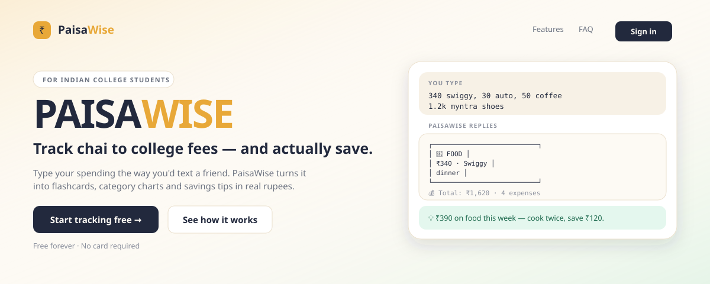
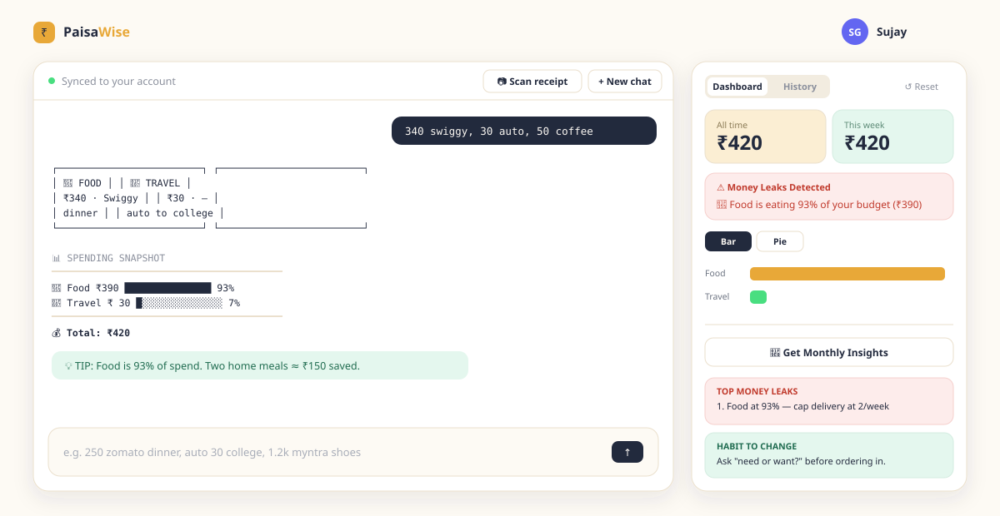
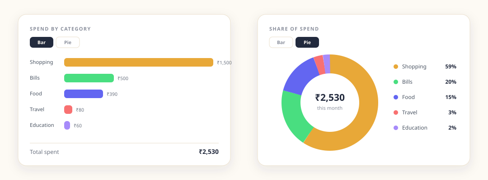
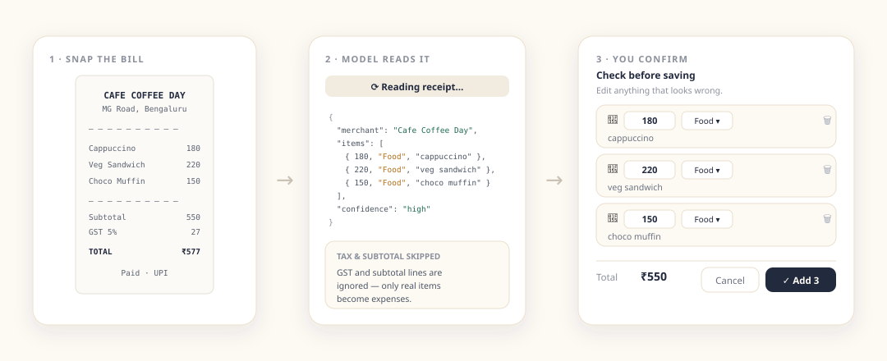
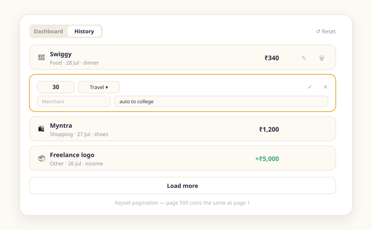

<div align="center">

# PaisaWise

**Smart expense assistant for Indian college students**

Type your spending the way you'd text a friend. Or just photograph the bill.

Built by **Sujay Gopal**

### [🔗 Live demo](https://paisawise-your-expense-buddy.onrender.com)
*Hosted on a free tier — the first load after inactivity takes ~60s while the server wakes.*

</div>



---

## What it does

Most budgeting apps make you fill a form for every chai. PaisaWise takes
`340 swiggy, 30 auto, 50 coffee` and turns it into three categorised expenses,
a chart, and a savings tip priced in rupees — built around how hostel, mess and
UPI spending actually works, not a US budgeting app's guess at it.

| | |
|---|---|
| **Type like you talk** | Amounts anywhere, `k` notation, `₹`/`Rs.`, comma-separated lists, or one per line |
| **Scan a receipt** | Photograph a bill and a vision model extracts each line item |
| **Built for India** | auto, mess, xerox, recharge, chai, rapido, blinkit — and UPI apps treated as payment method, not merchant |
| **Money leak detection** | Flags any category eating a disproportionate share |
| **Monthly AI insights** | Top 3 leaks, 3 realistic saving tips, 1 habit to change |
| **Real accounts** | Sign in from any device; data follows you |

---

## The app



Chat on the left, live dashboard on the right. Every expense you type is parsed
and saved instantly — the dashboard updates before the AI has finished replying.

---

## Charts



Toggle between a bar breakdown and a donut showing share of spend. Both are fed
by a single SQL aggregate, so they stay fast no matter how much history you have.

---

## Receipt scanning



Photograph a bill and the model reads each line item. It deliberately skips
tax, discount and subtotal lines so only real purchases become expenses.

**Nothing is saved until you approve it.** A misread amount silently entering
your ledger would be worse than no feature at all, so the scan returns a draft
you can edit, delete rows from, or cancel. Low-confidence reads are flagged.

---

## Expense history



Every expense is editable and deletable inline. Pagination is keyset-based, so
loading page 500 costs the same as page 1.

---

## Example prompts

PaisaWise is built to handle the messy way people actually type. These all work:

| You type | What gets logged |
|---|---|
| `250 zomato dinner with friends` | ₹250 · 🍕 Food · Zomato · "dinner with friends" |
| `340 swiggy, 30 auto, 50 coffee` | Three separate expenses: ₹340 Food, ₹30 Travel, ₹50 Food |
| `1.2k myntra shoes` | ₹1,200 · 🛍️ Shopping · Myntra · "shoes" |
| `auto to college 30` | ₹30 · 🚗 Travel — amount can go anywhere in the sentence |
| `gpay 500 rent share` | ₹500 · 📱 Bills — GPay is the payment method, rent is the purpose |
| `Rs. 1,500 amazon earphones` | ₹1,500 · 🛍️ Shopping — the comma is a thousands separator, not a delimiter |
| `earned 5000 freelance logo design` | ₹5,000 logged as **income**, excluded from spending totals |
| `120 mess fees` | ₹120 · 🍕 Food — Indian campus vocabulary is understood |
| `60 xerox notes` | ₹60 · 📚 Education |

Paste a whole day at once, one per line:

```
250 zomato dinner
30 auto college
1500 amazon earphones
120 chai snacks
500 rent share gpay
```

You get a flashcard per entry plus a category snapshot underneath.

### Asking for analysis

Beyond logging, you can just ask:

```
where is my money leaking this month?
how much did I spend on food this week?
I have ₹3000 left and 12 days to go — what should I cut?
give me 3 ways to earn on the side as a CS student
```

---

## Pricing

| | Free | Pro |
|---|---|---|
| **Price** | ₹0 | ₹99/month |
| Expenses | 50/month | Unlimited |
| AI messages | 5/day | Unlimited |
| Receipt scans | 3/month | Unlimited |
| Charts & leak detection | ✓ | ✓ |
| Monthly AI insights | — | ✓ |

Quotas are enforced server-side in `src/server/plans.server.ts` and return
**HTTP 402 Payment Required**, which the UI renders as an upgrade prompt. The two
metered actions — AI chat and receipt scanning — carry the tightest caps because
they are the only operations that cost real money per use.

> **No payments are processed.** Plan switching is a demo toggle gated behind
> `ALLOW_DEMO_UPGRADE`. Charging money in India requires a payment gateway, a
> registered business, KYC and GST. Going live means replacing one handler with
> a Razorpay webhook that sets the same column — nothing else changes.

---

## Tech stack

- **TanStack Start** (React 19 SSR) + TypeScript
- **PostgreSQL** — users, sessions, expenses, chat transcripts
- **Tailwind CSS v4** + Recharts
- **Vercel AI SDK** + Google Gemini (any OpenAI-compatible provider works)

## Quick start

```sh
npm install
cp .env.example .env    # fill in DATABASE_URL and AI_API_KEY
npm run dev
```

Need a local database:

```sh
docker run --name paisawise-db -e POSTGRES_PASSWORD=postgres \
  -e POSTGRES_DB=paisawise -p 5432:5432 -d postgres:16
```

Schema migrations run automatically on boot — there is no manual migration step.
Get a free Gemini API key at [aistudio.google.com/apikey](https://aistudio.google.com/apikey).

## Deployment

Free hosting on **Neon + Render** — see **[DEPLOYMENT.md](./DEPLOYMENT.md)**.

## Architecture

```
src/
  server/                 Server-only code
    db.server.ts          Postgres pool, migrations, session cleanup
    auth.server.ts        scrypt hashing, session tokens, cookies
    rate-limit.server.ts  Sliding-window limiter
    handler.server.ts     API error boundary + CSRF
    plans.server.ts       freemium limits and quota enforcement
  routes/api/
    auth/                 signup, login, logout, me
    expenses.ts           keyset-paginated list, bulk insert, clear
    expenses.$id.ts       edit / delete a single expense
    stats.ts              SQL-aggregated dashboard totals
    receipt.ts            vision-based receipt extraction
    chat.ts               AI assistant (auth-gated, rate limited)
    billing.ts            plans, usage, plan switching
    health.ts             healthcheck
  lib/
    api.ts                Browser API client
    expense-parser.ts     Natural-language expense parsing
```

**Why it holds up under load.** Aggregation happens in SQL — the browser never
downloads raw expense rows, so dashboard response size is constant whether a
user has 50 expenses or 5 million. Every query filters on `user_id` against a
composite index, so one user's data volume never affects another's. Writes are
capped at 500 rows per request with client-side chunking, one transaction each.

## Security

- Passwords hashed with **scrypt** (per-user random salt, constant-time compare)
- Session tokens are 256-bit random; only their SHA-256 is stored, so a database
  dump yields no usable sessions
- Cookies are `httpOnly` (XSS can't read them), `SameSite=Lax` (blocks CSRF), `Secure` in production
- Login timing is equalised and errors are generic, preventing user enumeration
- Changing a password invalidates every other session
- Single-expense edit/delete filter on `user_id` in the `WHERE` clause, so one
  user cannot touch another's rows even by guessing IDs
- All SQL uses bound parameters — no string interpolation anywhere
- Account deletion cascades to every table
- **CSRF**: every state-changing route checks `Sec-Fetch-Site`, with an
  Origin/Host comparison as fallback — TanStack's built-in middleware only
  covers server functions, not REST routes
- **Rate-limit integrity**: client IP is read from the *right* of
  `X-Forwarded-For` by `TRUSTED_PROXY_HOPS`. Reading the leftmost entry (the
  obvious approach) lets an attacker rotate a fake IP per request and bypass
  brute-force protection entirely
- **Database TLS** is verified against the public CA store on Neon and Supabase,
  or a pinned CA via `DATABASE_CA_CERT`. Where neither applies the app falls back
  to encrypted-but-unverified and logs a warning rather than failing silently

## Notes on the illustrations

The images above are hand-authored SVGs using the app's real design tokens and
colour palette, not screenshots. To replace one with a real capture, save a PNG
over the same path (`docs/hero.svg` → `docs/hero.png`) and update the `src` in
this file.

## License

MIT — Sujay Gopal
